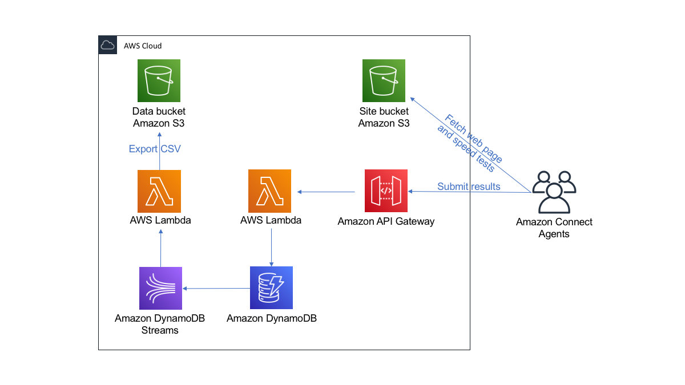
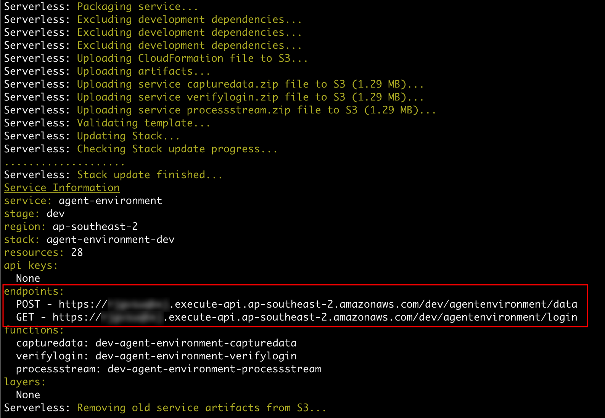
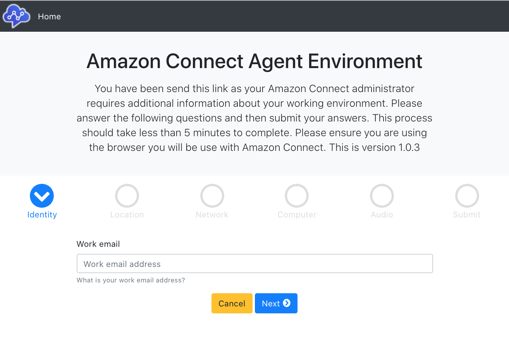
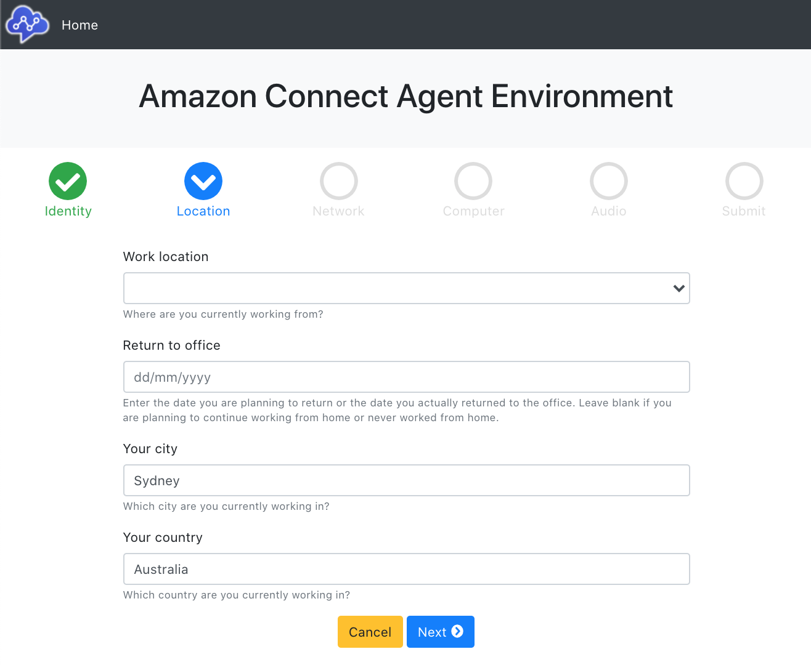
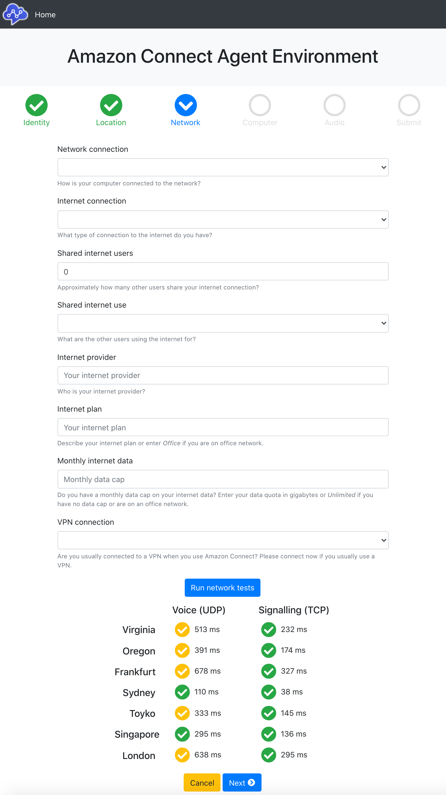
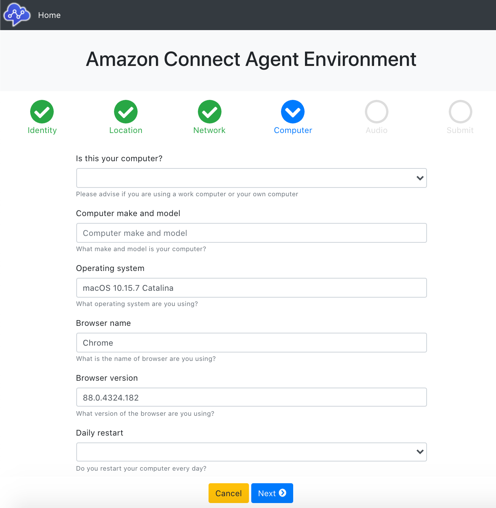
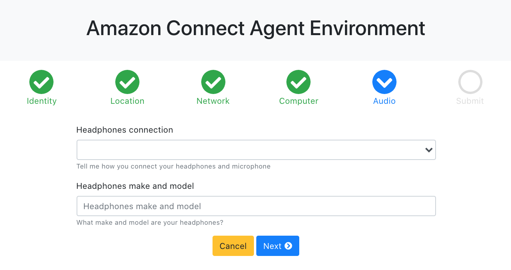
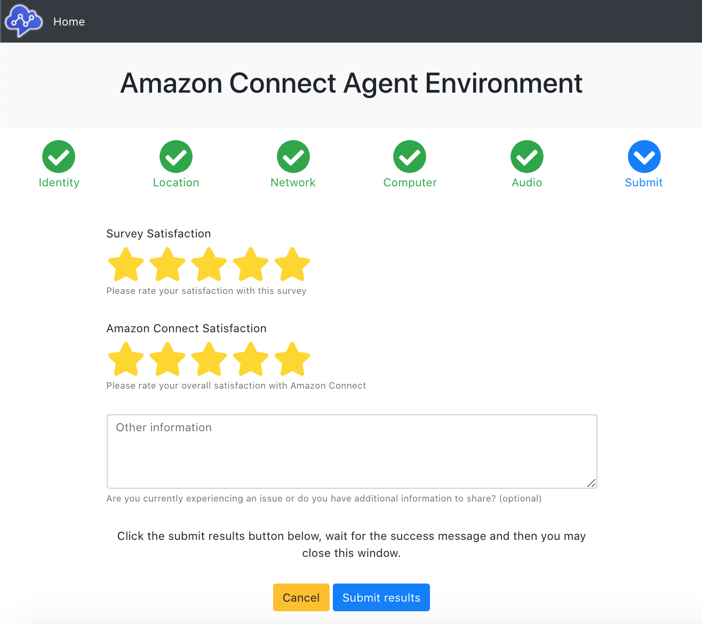

# Amazon Connect - Agent Environment

This project aims to provide a simple web interface to capture environmental information from Amazon Connect Agents, including hardware and network configurations.

## Architecture

The system uses Amazon S3 to serve a single page web application  to agents. Agents fill in survey fields and run speed tests against Amazon S3 in the deployed region.

Results are then submitted via API Gateway and stored in Amazon DynamoDB via a Lambda function.

Changes to the DynamoDB table trigger a DynamoDB Stream which calls a Lambda function to export all data to CSV (and JSON) into Amazon S3 for the administrator to collect.

## Building

To build locally you will require a Node.js and Serverless environment plus AWS credentials with sufficient permissions to deploy Lambda functions behind API Gateway, create IAM roles and policies, create DynamoDB tables, S3 buckets and copy data to S3.

You will also need to verify that your Amazon S3 account settings allow objects to be [public by Object ACL](https://docs.aws.amazon.com/AmazonS3/latest/userguide/configuring-block-public-access-account.html).

### Check out from Git

Check out the project from git locally with:

	git clone git@github.com:jospas/AgentEnvironment.git AgentEnvironment

### Clone the Git repository

Clone the Git repository and change to the project directory:

	> git clone git@github.com:jospas/AgentEnvironment.git
	> cd AgentEnvironment

### Install dependencies

Install Node.js, Serverless and the required packages.

For example on a Mac using [Home Brew](https://brew.sh/):

  	> brew install npm
  	> npm install -g serverless
  	
Ensure you are in the project directory then install the project NPM dependencies:
  	
  	> npm install

### Deploy the infrastructure

You will require the following variables for this step with `[default values]` listed in square brackets.

	<stage> the desired environment (dev, test or prod) [dev]
  	<profile> the name of a local AWS credentials profile [connect]
  	<region> the region you wish to deploy to [ap-southeast-2]
  	<apiKey> a long random string of your choice to protect the web application [CHANGEME]
  	<s3Prefix> the prefix to use in the data bucket when exporting data to S3 [agentdata]
  	<accountNumber> your AWS account number
  	<origin> your S3 site bucket origin [CHANGEME] 
  	  https://<stage>-agent-environment-site-<region>-<accountNumber>.s3.<region>.amazonaws.com 

To deploy using [Serverless](https://www.serverless.com/) (creates and deploys a CloudFormation stack) execute the following command replacing the variables from above in the root of the project directory:

	  > serverless deploy --stage <stage> \
	    --profile <profile> \
	    --region <region> \
	    --apiKey '<apiKey>' \
	    --accountNumber '<accountNumber>' \
	    --s3Prefix '<s3Prefix>' \
	    --origin '<origin>'
	    
Note that serverless outputs API Gateway end points to the console:

	endpoints:
  		POST - https://<apigwid>.execute-api.<region>.amazonaws.com/<stage>/agentenvironment/data
  		GET - https://<apigwid>.execute-api.<region>.amazonaws.com/<stage>/agentenvironment/login
  		
Please note your `<apigwid>` for for the following step.

### Deploy the web application

You may then configure and deploy the static website to S3. Edit the following file and enter your api end point and origin:
  
	web/config/site_config.json	

Replace the variables below, *respecting no trailng slash* on the API url:

	{
	  "version": "1.0.0",
	  "api": "https://<apigwid>.execute-api.<region>.amazonaws.com/dev/agentenvironment",
	  "origin": "https://<stage>-agent-environment-site-<region>-<accountNumber>.s3.<region>.amazonaws.com"
	}

Then deploy the web application to your site bucket:

    > cd web
    > aws s3 cp --profile <profile> \
	   --recursive \
	   --exclude '.DS_Store' \
	   --acl public-read \
	   . s3://<stage>-agent-environment-site-<region>-<accountNumber>
	  	
## Link format

Amazon Connect agents are provided a link to the user interface including an API key which is validated by the Lambda functions.

The link has the following format:

	https://<stage>-agent-environment-site-<region>-<accountNumber>.s3.<region>.amazonaws.com/index.html?apiKey=<apiKey>

## User interface

### Home

### Location

### Network

### Computer

### Audio

### Submit

## Sample data

The output CSV file has the following fields:

	captureDate
	email
	browserName
	browserVersion
	city
	computerModel
	country
	csatConnect
	csatSurvey
	dailyRestart
	deviceOwnership
	headphonesConnection
	headphonesMakeModel
	internetCap
	internetConnection
	internetPlan
	internetProvider
	internetUserCount
	internetUserType
	ip
	location
	networkConnection
	operatingSystem
	returnDate
	signalling-ap-northeast-1
	signalling-ap-southeast-1
	signalling-ap-southeast-2
	signalling-eu-central-1
	signalling-eu-west-2
	signalling-us-east-1
	signalling-us-west-2
	voice-ap-northeast-1
	voice-ap-southeast-1
	voice-ap-southeast-2
	voice-eu-central-1
	voice-eu-west-2
	voice-us-east-1
	voice-us-west-2
	vpnConnection
	userAgent
	notes
	
## Harvesting results

Results are written to the S3 data bucket and can be collected using the AWS CLI or via the AWS S3 Console:

    s3://<stage>-agent-environment-sata-<region>-<accountNumber>/<s3Prefix>/agent_environment.csv

JSON data is also written to the S3 data bucket:

    s3://<stage>-agent-environment-sata-<region>-<accountNumber>/<s3Prefix>/agent_environment.json

## Security

The API key provided at deployment time protects the API Gateway end points and is required to submit results.

To expire existing API keys, simply redeploy the solution with a new API key.

Agent data written to DynamoDB is encrypted at rest using KMS.

CSV and JSON data written to the data S3 bucket is not exposed in any fashion, administrators must harvest this from Amazon S3 when required and is encrypted at rest using KMS.

## Potential enhancements

- Daily email of captured results

## Cost

The system uses serverless technologies and should cost less than $5 USD per month to operate (includes $2 USD KMS costs).
